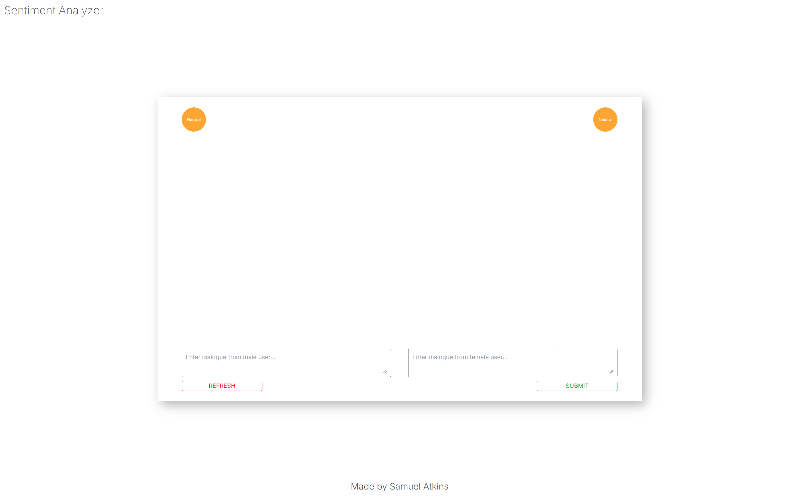
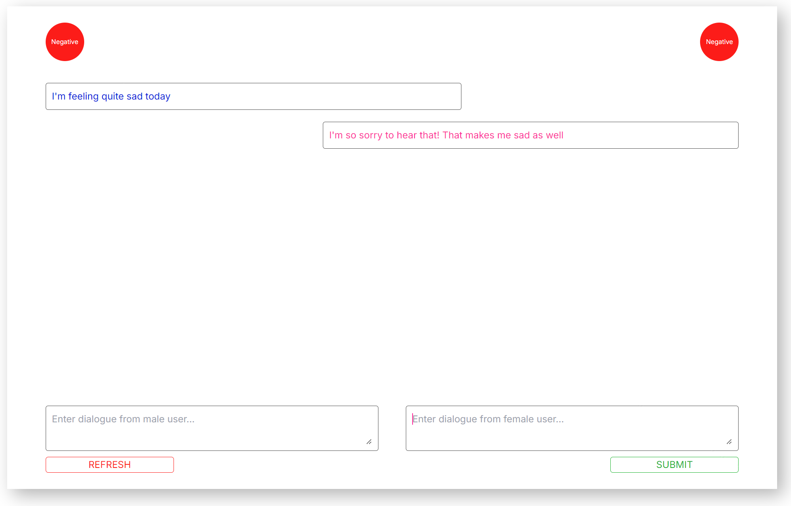
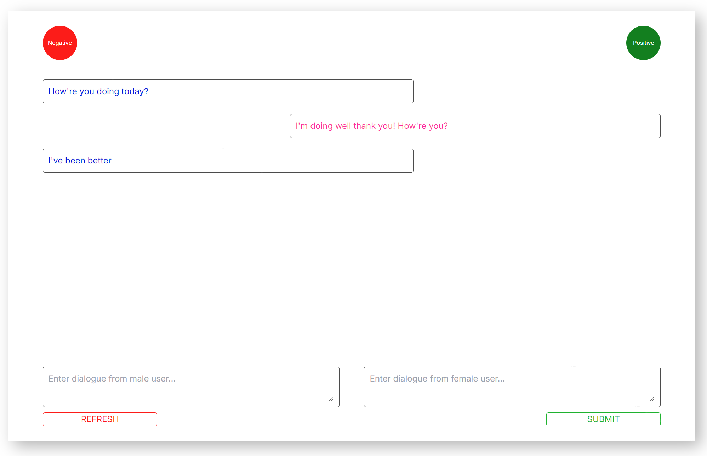

# Sentiment Analyzer

In this repository, I build a simple sentiment analysis UI that analyzes the sentiment of a conversation.

# Project Objectives

Develop a system to predict the sentiment of each participant in a conversation using a pre-trained language model and fine-tuning techniques.

### Stack

1. Open-source pre-trained language models which need to be fine-tuned
2. Fine-tune the model using an AWS instance
3. Provide a Dockerfile for deployment
4. Display the functionality of the model through a web interface
   - Users can input the text of a conversation
   - The output will be the sentiments of each participant (positive, neutral, negative)

# Model Ideation

**Simple Approach**

- Concatenate each speaker's text
- Train a single model that classifies the sentiment of each speaker using labels
- Apply the model on the total concatenated version of each speaker during inference

**More Involved Approach**

- Generate labels for each sentence
- Train a sentiment classification model on each of the sentences
- Generate another model / pipeline to aggregate the sentiment of each sentence

**Full-Context Approach**

- Keep the generated labels for each sentence pair
- Train an entire generation model that tags each sentence using <male>0.5</male> & <female>-0.2</female> tags

I went with the simple approach, as I am only budgeting a few hours for the project.

# Further Model Improvement Ideas

An obvious thing to do would be to use a new GPT pipeline to generate more training samples. With correct prompting and personas, this could drastically increase the variance of the data and the performance of the model.

# Result

View a sample of the final result working [here](media/sentiment.mov).

**UI overview**

**Sample conversation 1**

**Sample conversation 2**

